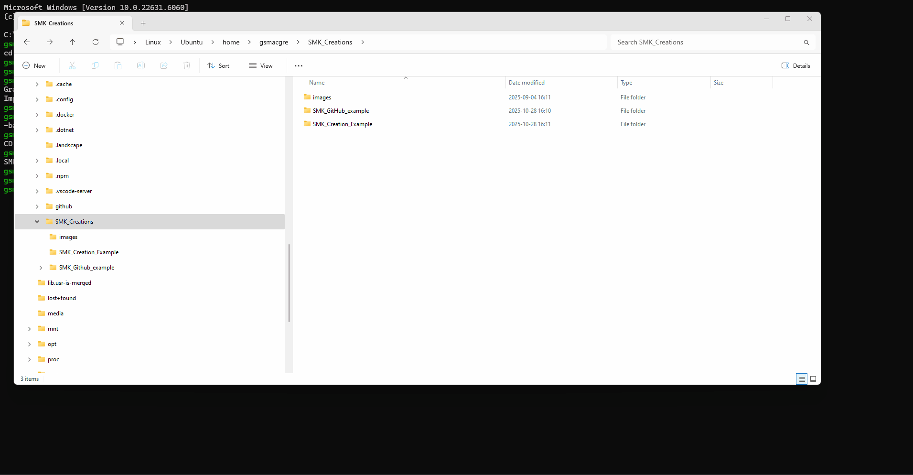
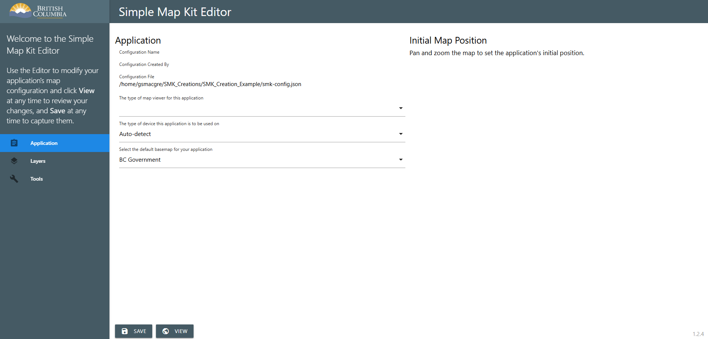
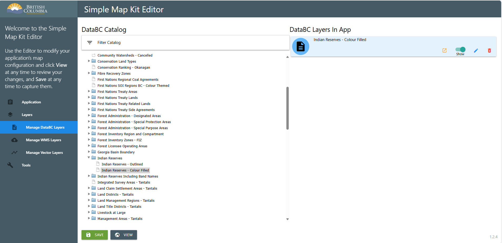
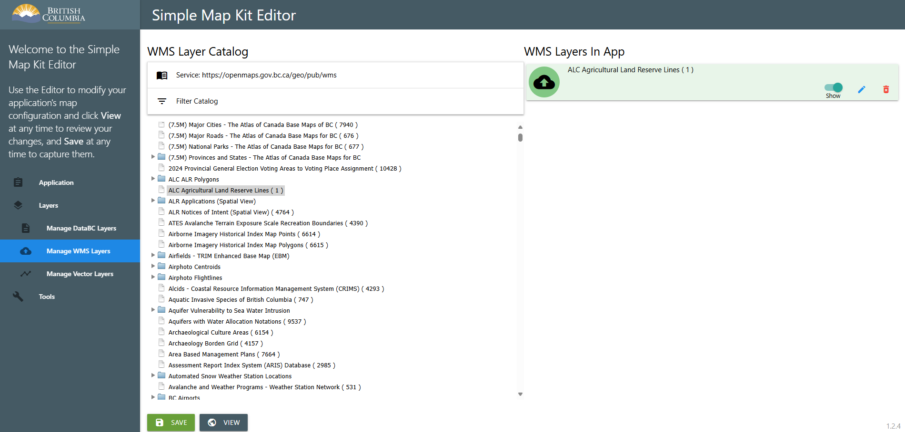
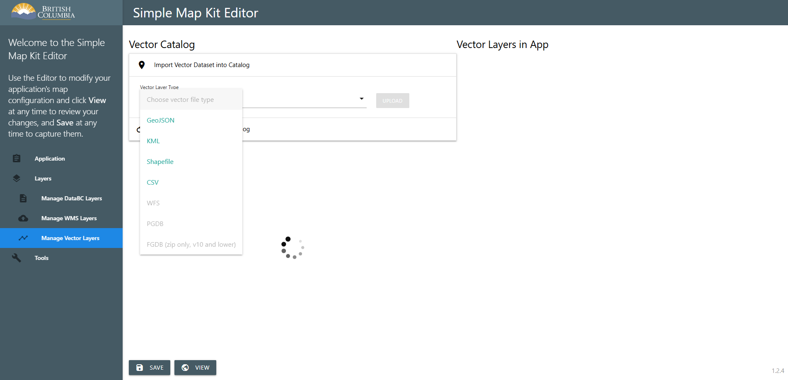
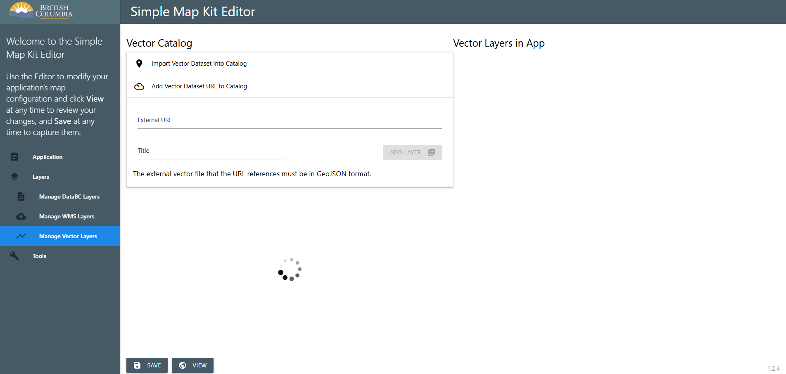
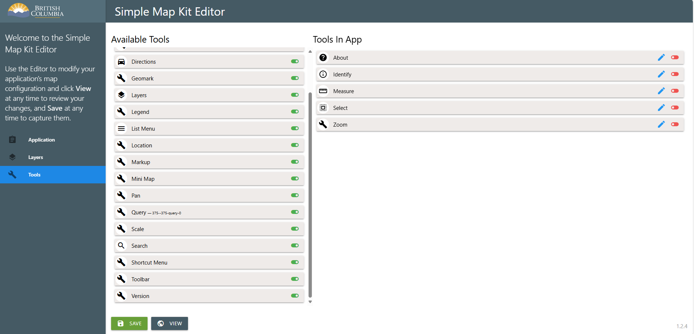

## Steps in installing and using SMK (Simple Map Kit)

Simple Mapkit allows users to create straight forward web mapping applications. These applications can then be modified and prepared for web deployment in a variety of methods. For the following example it will explain how to set up a SMK project within windows system for Linux (WSL) and deploy to GitHub pages as a stand alone web map.

The process will go through the following steps

1. Setting up Windows system for linux to be able to use Simple Map Kit (SMK)
2. Install Simple MapKit on Linux (WSL)
3. Create folders in Linux and then create an SMK project
4. Setting up and Editing your SMK project
5. Set up a GitHub repo which to transfer your SMK project and deploy application on Github pages.

## Windows System for Linux
1. Install Windows system for linux to use on windows.
- Start by reading the [WSL install on windows](<https://learn.microsoft.com/en-us/windows/wsl/install>)
- At the bottom of your file explorer you will see Linux and numerous folders within Linux
- Under the home folder you can add additional folders to your liking. It is reccomened to make a SMK_Creations folder where you will make new applications and a Github folder whre you can manage Github folders that are cloned from github.

## Install Simple Map kit (SMK) on WSL
Install SMK onto WSL
[Website] https://github.com/bcgov/smk-cli
- The website provides steps regarding installation
- You may need to experiment in WSL to install additional libraries SMK uses like Node.

## Creating a simple mapkit project
- For this exercise you can create a folder inside WSL folders under the (home) directory called "SMK_Creations"

- In WSL change the directory to SMK_Creations. e.g. cd SMK_Creations
- Enter 'smk create'. It will ask a number of questions about the initial set up of the application. Most are straight forward. See example 
- When asked to enter a package name of @bcgov/smk, enter as the stated example. This will create a folder within Node_modules/@bcgov that will contain key web map application files
- When it asks to open the application select yes.

- Now that you have a sample Simple Map Kit project created there are a number of editing functions that can be used to add data and modify their properties.

- Main editor screen. Select leaflet as map viewer

- DataBC layers can be added to the application. Each layer added has a pencil which can edit its properties. Properties include.
- Details. Min/Max Scale visibility, Opacity and name
- Attributes. Which ones to display, which one to use as a title and the geometry attribute
- Queries. Apply a query to the data to limit data visible
- Template formatting

- Add WMS Layers
- These have less editing properties do to being a WMS file.

- Import unique vector layers of various formats
- Unique data to your project can be added to the SMK project
- Data types include GeoJSON, KML, Shapefile, CSV

- Add vector data from URL layers
- GIS data from URL links can be aded to an application

- Select available tools to add to the location and modify settings through the editing pencil
- Tools have

## Make sure Visual Studio Code is installed on your computer
[Website] https://code.visualstudio.com/
- To connect VS Code to WSL. Open VS Code and Install WSL extension.
- When you have WSL open VSCode can connect to project folders within WSL folders. WSL needs to be open to access them

## Creating a GitHub repo to use GitHub pages under the bcgov organization
- Create a Github pages from a simple map kit you will need to create a new GitHub repo under the bcgov organization. Do not make the repo under your own Github account.
- When the Repo is created it can be cloned to the WSL github area in preperation to recive items created in Simple map kit.
[Website] https://learn.microsoft.com/en-us/azure/developer/javascript/how-to/with-visual-studio-code/clone-github-repository?tabs=activity-bar

## Set up GitHub area in WSL to put code.
- Example /github/(your project name created in GitHub)
- When you SMK application is ready and complete you can copy it into the created Github folder created when cloning the empty Repo. Once in the GitHub folder you will make some edits to the created application for it to work in GitHub pages.

## Copying and Modifying SMK project to work in GitHub pages.
- test

## Push SMK project and edits back up to GitHub repo
1. Review the content in the GIS Pantry [_start-here](../_start-here) folder.
- Start by reading the [GIS_Pantry_QuickStart Doc](<QuickStart - BEGIN HERE.md>)
GeoBC Implementation Team repository for work we do.

